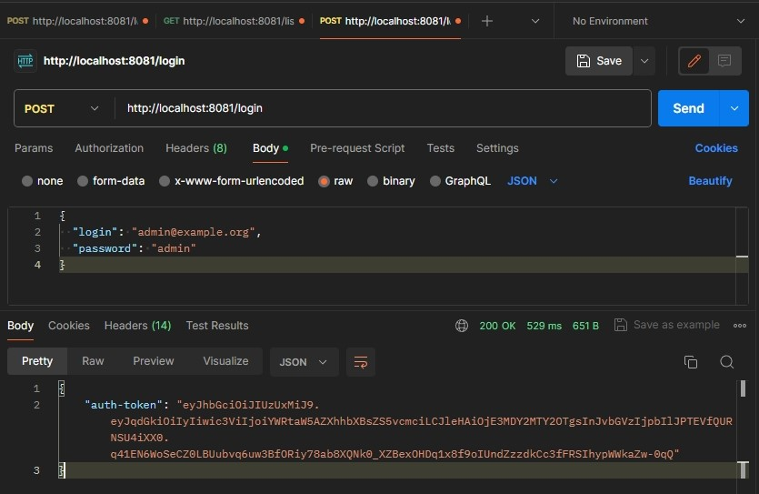

# Дипломная работа «Облачное хранилище»

## Описание проекта
Проект для интеграции с [FRONT](https://github.com/netology-code/jd-homeworks/tree/master/diploma/netology-diplom-frontend), представляет собой REST-интерфейс для загрузки файлов и вывода списка уже загруженных файлов пользователя по заранее описанной [спецификации](https://github.com/netology-code/jd-homeworks/blob/master/diploma/CloudServiceSpecification.yaml).

## Функциональные возможности сервиса
Сервис реализует следующие операции:
- Авторизация пользователя;
- Загрузка, переименование, скачивание, удаление файлов;
- Отображение списка файлов.

## Реализация сервиса
- Серверная часть разработана на языке **Java** с использованием __Spring Boot__ и __Spring Security__;
- Использован сборщик пакетов __Maven__;
- Хранение и миграция данных: __PostgreSQL__, __Liquibase__ ;
- Авторизация с помощью __JSON Web Token__;
- Модульное тестирование выполнено с использованием __JUnit__, __Mockito__;
- Добавлен интеграционный тест с использованием __Testcontainers__;
- Для запуска используются: `Dockerfile`, `docker-compose.yaml`;
- Основные параметры сконфигурированы через файл `application.properties`;

*Архитектура приложения имеет многослойную структуру с разделением ответственности между различными компонентами.*

## Запуск и тестирование с Postman
Запуск сервиса осуществляется [по адресу](http://localhost:8081) в терминале, с помощью команды: `docker-compose up`.

Доступные учетные записи:
- ROLE_USER:
  - login: user@example.org
  - password: user
- ROLE_ADMIN:
  - login: admin@example.org
  - password: admin
  

  
Эндпоинты:
- POST http://localhost:8081/login
- POST http://localhost:8081/logout
- POST http://localhost:8081/cloud/file?filename=new.txt
- DELETE http://localhost:8081/cloud/file?filename=new.txt
- GET http://localhost:8081/cloud/file?filename=new.txt
- PUT http://localhost:8081/cloud/file?filename=new.txt
- GET http://localhost:8081/cloud/list?limit=3

